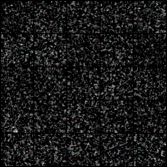
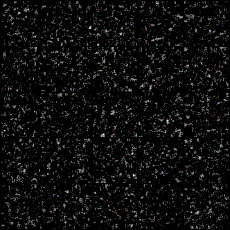
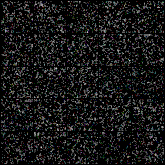
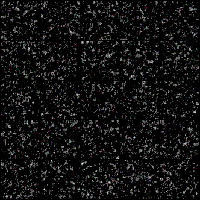

# 1. DCGAN on scratch  
```shell
python wafergan.py --n_epochs 100000
```

## 1.2. 
- Usage Dataset  
- [WM-811K](https://www.kaggle.com/qingyi/wm811k-wafer-map)

## 1.2. 
- Result   
- Center  

- Donut  

- Edge ring  

- Scratch  
